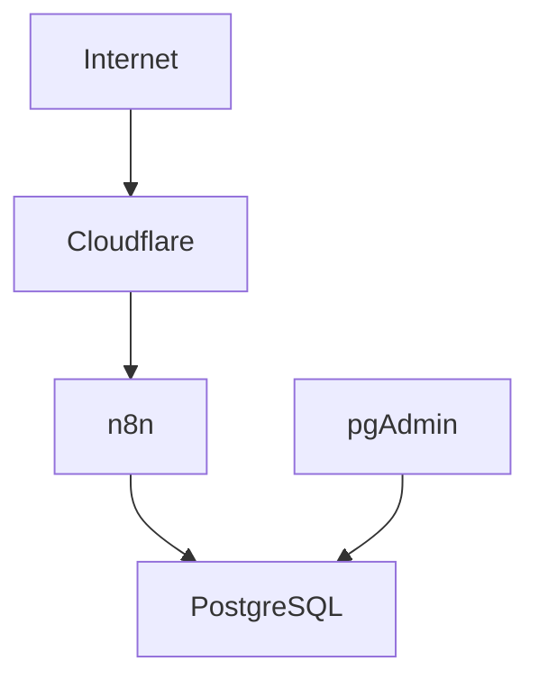

[](https://docs.docker.com/compose/)
[](https://www.postgresql.org/docs/)
[](https://docs.n8n.io/)
[](https://www.pgadmin.org/docs/)
[](https://developers.cloudflare.com/cloudflare-one/connections/connect-networks/)


## Explicación del archivo `docker-compose.yml` de Hooklight

# 📑 Índice

### > 💡 Click en cada sección para expandir el contenido:

<details>
<summary><strong>📌 1. Introducción</strong></summary>

- [¿Qué es docker-compose.yml?](#qué-es-este-archivo-y-para-qué-sirve)

</details>

<details>
<summary><strong>🏗️ 2. Arquitectura</strong></summary>

- [Flujo del sistema](#cómo-se-comunican-entre-sí-los-servicios)
- [Diagrama](#-arquitectura-del-sistema)

</details>

<details>
<summary><strong>🐳 3. Docker Compose</strong></summary>

- [Versión](#explicación-línea-por-línea-y-por-secciones)
- [📦 Servicios: ](#services)
  - [🐘 PostgreSQL](#servicio-postgres)
  - [⚙️ n8n](#servicio-n8n)
  - [🗄️ pgAdmin](#servicio-pgadmin)
  - [🌐 Cloudflare](#servicio-cloudflare)
- [Volúmenes](#bloque-volumes)
- [Redes / Networks](#bloque-networks)

</details>

<details>
<summary><strong>🔌 4. Puertos  </strong></summary>

- [Puertos](#-puertos-expuestos)

</details>

<details>
<summary><strong>📁 5. Archivo `.env`</strong></summary>

- [Explicación](#-archivo-env)

</details>

<details>
<summary><strong>⚠️ 6. Comandos importantes</strong></summary>

- [Comandos](#comandos-importantes)

</details>

<details>
<summary><strong>🛠️ 7. Troubleshooting</strong></summary>

- [Problemas comunes y soluciones](#️-troubleshooting-problemas-comunes)

</details>

<details>
<summary><strong>🛡️ 8. Seguridad</strong></summary>

- [Seguridad del entorno](#️-seguridad-hardening-del-entorno)
- [Backup](#-backup-y-recuperación-de-credenciales-en-n8n)

</details>

<details>
<summary><strong>👁️ 9. Evaluación</strong></summary>

- [Ventajas](#ventajas-de-esta-arquitectura)
- [Riesgos](#riesgos-o-puntos-a-mejorar)

</details>

<details>
<summary><strong>📌 10. Conclusión</strong></summary>

- [Cierre técnico](#conclusión-técnica)

</details>

---

## ¿Qué es este archivo y para qué sirve?

Este archivo sirve para **definir, organizar y levantar varios contenedores Docker juntos** como si fueran un solo sistema.  
En lugar de ejecutar muchos comandos por separado, acá se deja todo escrito en un único archivo para que Docker Compose pueda:

- crear los servicios,
- conectarlos entre sí,
- asignarles variables de entorno,
- exponer puertos,
- guardar datos persistentes,
- y controlar el orden de inicio.

En este caso, el archivo arma una arquitectura compuesta por **cuatro servicios**:

1. **PostgreSQL** → base de datos  
2. **n8n** → motor de automatización  
3. **pgAdmin** → panel web para administrar PostgreSQL  
4. **Cloudflare** → túnel para exponer n8n a Internet mediante Cloudflare  

Además, define:

- **volúmenes** para que los datos no se pierdan,
- **una red interna** para que los contenedores se comuniquen.

---

# ¿Cómo se comunican entre sí los servicios?

## Flujo general del sistema

### 1. PostgreSQL
Guarda datos persistentes.

### 2. n8n
Se conecta a PostgreSQL y ejecuta los workflows.

### 3. pgAdmin
Se conecta a PostgreSQL para administración manual.

### 4. Cloudflare
Publica n8n en Internet mediante un túnel seguro.

---

## 🧩 Arquitectura del sistema



---

##  Docker compose 

## Explicación línea por línea y por secciones

```yaml
version: "3.8"
```

### ¿Qué es?
Indica la **versión del formato de Docker Compose** que se está utilizando.

### ¿Para qué sirve?
Le dice a Docker cómo interpretar la estructura del archivo.  
No es la versión de Docker instalada, sino la **versión de sintaxis del compose**.

### ¿Qué función cumple acá?
La versión `3.8` es una versión moderna y ampliamente compatible, suficiente para usar servicios, redes, volúmenes, puertos, variables de entorno y dependencias.

---

<a id="services"></a>
```yaml
services:
```

### ¿Qué es?
Es la sección donde se definen los **contenedores principales** del sistema.

### ¿Para qué sirve?
Cada servicio representa una parte de la aplicación.  
Docker Compose los crea, levanta y administra automáticamente.

### En este archivo se definen 4 servicios:
- `postgres`
- `n8n`
- `pgadmin`
- `cloudflare`

---

##  `Servicio postgres`

```yaml
  postgres:
    image: postgres:15
    container_name: postgres
    restart: always
    healthcheck:
      test: ["CMD-SHELL", "pg_isready -U ${POSTGRES_USER} -d ${POSTGRES_DB}"]
      interval: 10s
      timeout: 5s
      retries: 5
    environment:
      POSTGRES_USER: ${POSTGRES_USER}
      POSTGRES_PASSWORD: ${POSTGRES_PASSWORD}
      POSTGRES_DB: ${POSTGRES_DB}
    ports:
      - "5432:5432"
    volumes:
      - postgres_data:/var/lib/postgresql/data
    networks:
      - tesis_network
```

### ¿Qué es **postgres**?
Es el servicio que ejecuta **PostgreSQL**, un sistema de gestión de base de datos relacional.

### ¿Para qué sirve PostgreSQL en este proyecto?
Sirve para **guardar información persistente** del sistema Hooklight.  
Por ejemplo:

- workflows de n8n,
- credenciales,
- ejecuciones,
- registros,
- eventos,
- métricas del sistema,
- o cualquier tabla adicional que use el proyecto.

---

```yaml
image: postgres:15
```

### ¿Qué es?
Indica la imagen Docker que se va a usar.

### ¿Para qué sirve?
Docker descarga y ejecuta la imagen oficial de PostgreSQL versión 15.

### ¿Qué función cumple?
Permite crear un contenedor con PostgreSQL ya listo, sin tener que instalarlo manualmente en Windows o Linux.

---

```yaml
container_name: postgres
```

### ¿Qué es?
Es el nombre fijo que tendrá el contenedor.

### ¿Para qué sirve?
Facilita identificarlo con comandos como:

```bash
docker ps
docker logs postgres
docker exec -it postgres bash
```

### ¿Qué función cumple?
Hace más simple la administración, porque no queda con un nombre aleatorio generado por Docker.

---

```yaml
restart: always
```

### ¿Qué es?
Es una política de reinicio automático.

### ¿Para qué sirve?
Si el contenedor se cae, falla o la máquina se reinicia, Docker intentará volver a levantarlo automáticamente.

### ¿Qué función cumple acá?
Ayuda a que la base de datos quede siempre disponible.

---

```yaml
healthcheck:
  test: ["CMD-SHELL", "pg_isready -U ${POSTGRES_USER} -d ${POSTGRES_DB}"]
  interval: 10s
  timeout: 5s
  retries: 5
```
### ¿Qué es?
Es un mecanismo que permite verificar si PostgreSQL está realmente listo para aceptar conexiones.

### ¿Para qué sirve?
Evita que otros servicios (como n8n) intenten conectarse antes de tiempo.

### ¿Cómo funciona?
- Ejecuta el comando pg_isready
- Verifica si la base responde correctamente
- Reintenta varias veces hasta considerarlo “saludable”

### ¿Por qué es importante?
Sin esto, Docker puede arrancar n8n aunque PostgreSQL todavía no esté listo, generando errores de conexión.

```yaml
test: ["CMD-SHELL", "pg_isready -U ${POSTGRES_USER} -d ${POSTGRES_DB}"]
```
### ¿Qué hace?
Ejecuta un comando dentro del contenedor.

```yaml
test: ["CMD-SHELL", pg_isready -U usuario -d base_de_datos]
```
### ¿Qué es `pg_isready`?
Es una herramienta de PostgreSQL que responde si esta listo para conexiones.

### ¿Qué es `-U ${POSTGRES_USER}`?
Es el usuario de la base de datos.

### ¿Qué es `-d ${POSTGRES_DB}`?
Es la base de datos.

```yaml
interval: 10s
```
Cada cuánto se ejecuta el test (10 seg en este caso). (“Cada 10 segundos pregunto: ¿ya está lista la DB?”)

```yaml
timeout: 5s
```
Cuánto espera el resultado del comando (Máximo: 5 segundos). (“Si en 5 segundos no responde, lo considero fallido”)

```yaml
retries: 5
```
Cuántos intentos fallidos antes de marcarlo como “unhealthy” (“Si falla 5 veces seguidas → está roto”)

---

```yaml
environment:
  POSTGRES_USER: ${POSTGRES_USER}
  POSTGRES_PASSWORD: ${POSTGRES_PASSWORD}
  POSTGRES_DB: ${POSTGRES_DB}
```

### ¿Qué es?
Son variables de entorno que se le pasan al contenedor al iniciarse.

### ¿Para qué sirven?
Configuran PostgreSQL automáticamente.

### Explicación de cada una:

```yaml
POSTGRES_USER: ${POSTGRES_USER}
```
Crea el usuario principal de la base de datos con nombre `hooklight`

```yaml
POSTGRES_PASSWORD: ${POSTGRES_PASSWORD}
```
Define la contraseña del usuario `hooklight`

```yaml
POSTGRES_DB: ${POSTGRES_DB}
```
Crea automáticamente una base de datos llamada `phishing_awareness`

### Resultado práctico
Cuando PostgreSQL arranca por primera vez:
- se crea la base,
- se crea el usuario,
- se asignan permisos.

---

```yaml
ports:
  - "5432:5432"
```

### ¿Qué es?
Mapea puertos entre la máquina host y el contenedor.

### ¿Para qué sirve?
Permite acceder a PostgreSQL desde afuera del contenedor.

### ¿Qué significa **"5432:5432"**?
- El primer `5432` es el puerto en tu computadora (host)
- El segundo `5432` es el puerto dentro del contenedor

### ¿Qué función cumple?
Te permite conectarte a PostgreSQL desde:
- pgAdmin,
- DBeaver,
- TablePlus,
- scripts locales,
- psql desde la PC.

---

```yaml
volumes:
  - postgres_data:/var/lib/postgresql/data
```

### ¿Qué es?
Asocia un volumen persistente con una carpeta interna del contenedor.

### ¿Para qué sirve?
Hace que los datos **no se pierdan** aunque el contenedor se elimine o reinicie.

### ¿Qué función cumple esa ruta?
`/var/lib/postgresql/data` es la carpeta donde PostgreSQL guarda físicamente la base de datos.

### Resultado
Todo queda almacenado en el volumen `postgres_data`.

Sin esto, al borrar el contenedor se perdería la base.

---

```yaml
networks:
  - tesis_network
```

### ¿Qué es?
Indica a qué red Docker pertenece el contenedor.

### ¿Para qué sirve?
Permite la comunicación con otros servicios del compose.

### ¿Qué función cumple?
Hace que `n8n` pueda conectarse a PostgreSQL usando el nombre `postgres` como host.

---

##  `Servicio n8n`

```yaml
  n8n:
    image: n8nio/n8n
    container_name: n8n
    restart: always
    ports:
      - "5678:5678"
    environment:
      DB_TYPE: postgresdb
      DB_POSTGRESDB_HOST: postgres
      DB_POSTGRESDB_PORT: 5432
      DB_POSTGRESDB_DATABASE: ${POSTGRES_DB}
      DB_POSTGRESDB_USER: ${POSTGRES_USER}
      DB_POSTGRESDB_PASSWORD: ${POSTGRES_PASSWORD}
      N8N_BASIC_AUTH_ACTIVE: "true"
      N8N_BASIC_AUTH_USER: ${N8N_USER}
      N8N_BASIC_AUTH_PASSWORD: ${N8N_PASSWORD}
      N8N_ENCRYPTION_KEY: ${N8N_ENCRYPTION_KEY}
      WEBHOOK_URL: "https://www.hooklight.org/"
      N8N_HOST: "hooklight.org"
      N8N_PROTOCOL: "https"
      N8N_PROXY_HOPS: "1"
      N8N_EDITOR_BASE_URL: "https://www.hooklight.org"
    depends_on:
      postgres:
        condition: service_healthy
    volumes:
      - n8n_data:/home/node/.n8n
    networks:
      - tesis_network
```

### ¿Qué es **n8n**?
Es la plataforma de automatización que ejecuta workflows.

### ¿Para qué sirve en Hooklight?
Es el corazón del sistema.  
Se usa para:

- leer participantes,
- enviar correos,
- recibir aperturas y clics,
- procesar webhooks,
- guardar eventos,
- automatizar la lógica de la simulación de phishing.

---

```yaml
image: n8nio/n8n
```
Usa la imagen oficial de n8n.

---

```yaml
container_name: n8n
```
Le pone al contenedor el nombre fijo `n8n`

---

```yaml
restart: always
```
Hace que n8n vuelva a iniciarse automáticamente si se cae o si reinicia Docker.

---

```yaml
ports:
  - "5678:5678"
```
### ¿Qué hace?
Expone el puerto web de n8n.

### Resultado
Podés entrar desde el navegador a: `http://localhost:5678`

o, si está detrás de Cloudflare y dominio, mediante la URL pública configurada: `www.hooklight.org`

---

## Variables de base de datos

```yaml
environment:
  DB_TYPE: postgresdb
  DB_POSTGRESDB_HOST: postgres
  DB_POSTGRESDB_PORT: 5432
  DB_POSTGRESDB_DATABASE: ${POSTGRES_DB}
  DB_POSTGRESDB_USER: ${POSTGRES_USER}
  DB_POSTGRESDB_PASSWORD: ${POSTGRES_PASSWORD}
```

### ¿Qué son?
Son variables que le indican a n8n que use PostgreSQL en lugar de SQLite.

### ¿Para qué sirven?
Permiten que n8n guarde sus datos en una base robusta y persistente.

### Explicación una por una:

```yaml
DB_TYPE: postgresdb
```
Le dice a n8n que el motor de base de datos será PostgreSQL.

```yaml
DB_POSTGRESDB_HOST: postgres
```
El host es `postgres`, que coincide con el nombre del servicio Docker.  
Dentro de la red interna, Docker resuelve ese nombre automáticamente.

```yaml
DB_POSTGRESDB_PORT: 5432
```
Puerto estándar de PostgreSQL.

```yaml
DB_POSTGRESDB_DATABASE: ${POSTGRES_DB}
```
Nombre de la base que n8n debe usar.

```yaml
DB_POSTGRESDB_USER: ${POSTGRES_USER}
```
Usuario para autenticarse.

```yaml
DB_POSTGRESDB_PASSWORD: ${POSTGRES_PASSWORD}
```
Contraseña del usuario.

### Función general
Con estas variables, n8n no guarda información “adentro suyo” de forma aislada, sino en PostgreSQL.

---

## Autenticación básica

```yaml
N8N_BASIC_AUTH_ACTIVE: "true"
N8N_BASIC_AUTH_USER: ${N8N_USER}
N8N_BASIC_AUTH_PASSWORD: ${N8N_PASSWORD}
N8N_ENCRYPTION_KEY: ${N8N_ENCRYPTION_KEY}
```

### ¿Qué es?
Es una protección por usuario y contraseña para entrar a la interfaz web de n8n.

### ¿Para qué sirve?
Evita que cualquiera que acceda a la URL vea o modifique los workflows.

### Explicación:

```yaml
N8N_BASIC_AUTH_ACTIVE: "true"
```
Activa la autenticación básica HTTP.

```yaml
N8N_BASIC_AUTH_USER: ${N8N_USER}
```
Usuario de acceso.

```yaml
N8N_BASIC_AUTH_PASSWORD: ${N8N_PASSWORD}
```
Contraseña de acceso.

### Función práctica
Cuando alguien entra a n8n desde el navegador, primero debe autenticarse.

## Variable encriptada (CRÍTICO 🔐)

```yaml
N8N_ENCRYPTION_KEY: ${N8N_ENCRYPTION_KEY}
```
Es la clave utilizada por n8n para cifrar y descifrar credenciales sensibles almacenadas en el sistema.

⚠️ Debe cumplir con lo siguiente: ⚠️
- Mínimo 32 caracteres
- Mezcla de letras, números y símbolos
- Sin espacios

### ¿Para qué sirve?
Protege información como:
- API keys
- Contraseñas
- Tokens
- Credenciales externas

### ¿Por qué es crítica?
Si esta clave cambia:
- ❌ n8n no puede desencriptar credenciales existentes
- ❌ se pierde acceso a integraciones configuradas

### ¿Cómo generar la clave?

1. Manualmente (cumpliendo con los requisitos previos)
2. Desde la consola (cmd) con el siguiente comando:
`[guid]::NewGuid().ToString() + [guid]::NewGuid().ToString()`
Este comando arroja una clave aleatoria


### `⚠️ DEBE SER **PERMANENTE**, NO PUEDE CAMBIAR ⚠️`

### 💥 Error típico

Cambiar la clave después de haber creado credenciales, provoca errores como: **Credentials could not be decrypted**

---

## Variables relacionadas con URL, host y proxy

```yaml
WEBHOOK_URL: "https://www.hooklight.org/"
N8N_HOST: "hooklight.org"
N8N_PROTOCOL: "https"
N8N_PROXY_HOPS: "1"
N8N_EDITOR_BASE_URL: "https://www.hooklight.org"
```

Estas variables son claves cuando n8n está detrás de un proxy o túnel como **Cloudflare**.

```yaml
WEBHOOK_URL: "https://www.hooklight.org/"
```
Define la URL pública base que n8n debe usar para construir webhooks externos.

#### ¿Por qué es importante?
Si n8n genera webhooks con `localhost`, no funcionarían desde Internet.  
Con esta variable, n8n sabe que debe publicar rutas como:

`https://www.hooklight.org/webhook/...`

```yaml
N8N_HOST: "hooklight.org"
```
Indica el host principal de la aplicación.

```yaml
N8N_PROTOCOL: "https"
```
Indica que el acceso público se realiza por HTTPS.

```yaml
N8N_PROXY_HOPS: "1"
```
Le dice a n8n que está detrás de **un proxy inverso**.

#### ¿Para qué sirve?
Para interpretar correctamente cabeceras como:
- `X-Forwarded-For`
- `X-Forwarded-Proto`

Esto es importante cuando Cloudflare reenvía tráfico hacia el contenedor.

```yaml
N8N_EDITOR_BASE_URL: "https://www.hooklight.org"
```
Define la URL pública del editor web de n8n.

#### ¿Para qué sirve?
Ayuda a que enlaces internos, redirecciones y partes del frontend apunten al dominio correcto.

---

```yaml
depends_on:
  postgres:
    condition: service_healthy
```

### ¿Qué es?
Una dependencia avanzada que no solo define orden de inicio, sino que espera a que el servicio esté listo.

### ¿Para qué sirve?
Hace que `n8n` arranque solo cuando `PostgreSQL` está completamente operativo.

---

```yaml
volumes:
  - n8n_data:/home/node/.n8n
```

### ¿Qué es?
Un volumen persistente para los datos internos de n8n.

### ¿Qué guarda ahí?
Entre otras cosas:
- configuraciones,
- credenciales,
- archivos internos,
- datos del usuario de n8n.

### ¿Para qué sirve?
Para que no se pierda la configuración al reiniciar o recrear el contenedor.

---

```yaml
networks:
  - tesis_network
```
Conecta n8n a la red interna `tesis_network`

---

##  `Servicio pgadmin`

```yaml
  pgadmin:
    image: dpage/pgadmin4
    container_name: pgadmin
    restart: always
    environment:
      PGADMIN_DEFAULT_EMAIL: hooklightar@gmail.com
      PGADMIN_DEFAULT_PASSWORD: ${PGADMIN_PASSWORD}
    ports:
      - "5050:80"
    depends_on:
      postgres:
        condition: service_healthy
    volumes:
      - pgadmin_data:/var/lib/pgadmin
    networks:
      - tesis_network
```

### ¿Qué es pgAdmin?
Es una interfaz gráfica web para administrar PostgreSQL.

### ¿Para qué sirve?
Permite:
- ver bases de datos,
- crear tablas,
- ejecutar consultas SQL,
- revisar registros,
- importar/exportar datos,
- administrar usuarios.

---

```yaml
image: dpage/pgadmin4
```
Usa la imagen oficial de pgAdmin 4.

---

```yaml
container_name: pgadmin
```
Le pone un nombre fijo al contenedor.

---

```yaml
restart: always
```
Hace que se reinicie automáticamente.

---

## Variables de entorno

```yaml
environment:
  PGADMIN_DEFAULT_EMAIL: hooklightar@gmail.com
  PGADMIN_DEFAULT_PASSWORD: ${PGADMIN_PASSWORD}
```

### ¿Qué hacen?
Crean el usuario inicial con contraseña para ingresar a la interfaz de pgAdmin.

### Importante
Estas credenciales son **para entrar a pgAdmin**, no necesariamente para la base PostgreSQL.  
Después, dentro de pgAdmin, igualmente tenés que registrar el servidor PostgreSQL con sus propios datos.

---

```yaml
ports:
  - "5050:80"
```
### ¿Qué significa?
- Puerto `5050` en tu PC (host)
- Puerto `80` dentro del contenedor

### Resultado
Podés entrar a pgAdmin desde:

`http://localhost:5050`

---

```yaml
depends_on:
  postgres:
    condition: service_healthy
```
Indica que el servicio depende de PostgreSQL y solo se iniciará cuando este esté en estado healthy (listo para aceptar conexiones), no simplemente cuando el contenedor haya arrancado.

---

```yaml
volumes:
  - pgadmin_data:/var/lib/pgadmin
```
Un volumen persistente para pgAdmin.

### ¿Para qué sirve?
Guarda:
- servidores registrados
- configuraciones
- sesiones

### ¿Qué pasa si no está?
Cada vez que se recrea el contenedor:
- ❌ se pierde toda la configuración de pgAdmin

---

```yaml
networks:
  - tesis_network
```
Lo conecta a la misma red interna, así puede llegar al servicio `postgres`

---

##  `Servicio cloudflare`

```yaml
  cloudflare:
    image: cloudflare/cloudflared:2024.8.2
    container_name: cloudflare
    restart: unless-stopped
    command: tunnel --no-autoupdate --protocol http2 run
    environment:
      TUNNEL_TOKEN: ${TUNNEL_TOKEN}
    depends_on:
      - n8n
    networks:
      - tesis_network
```

### ¿Qué es este servicio?
Es un contenedor que ejecuta **Cloudflare**, el cliente de Cloudflare Tunnel.

### ¿Para qué sirve?
Permite exponer el servicio `n8n` a Internet **sin abrir puertos manualmente en el router**.

### Función dentro del proyecto
Hace posible que:
- los webhooks de n8n sean accesibles desde fuera,
- Mailgun o cualquier servicio externo pueda pegarle a una URL pública,
- se use un dominio como `hooklight.org` o `www.hooklight.org`.

---

```yaml
image: cloudflare/cloudflared:2024.8.2
```
Usa la imagen de `cloudflare` con la version especifica 2024.8.2

### ¿Por qué es mejor que "latest"?
- ✔ Evita cambios inesperados
- ✔ Garantiza reproducibilidad
- ✔ Hace el entorno más estable

---

```yaml
container_name: cloudflare
```
Le asigna el nombre fijo `cloudflare`

---

```yaml
restart: unless-stopped
```

### ¿Qué significa?
Se reinicia automáticamente salvo que vos lo hayas detenido manualmente.

### Diferencia con `always`
- `always` intenta reiniciarse siempre.
- `unless-stopped` no se levanta si vos lo apagaste intencionalmente.

---

```yaml
command: tunnel --no-autoupdate --protocol http2 run
```

### ¿Qué es?
Es el comando que ejecuta el contenedor al arrancar.

### ¿Qué hace?
- inicia el túnel,
- desactiva las autoactualizaciones,
- usa HTTP/2 como protocolo,
- corre el túnel asociado al token.

### Explicación de cada parte:

#### `tunnel`
Indica que se usará la función de túneles de Cloudflare.

#### `--no-autoupdate`
Evita que el binario intente actualizarse automáticamente dentro del contenedor.

#### `--protocol http2`
Usa HTTP/2 para la comunicación.

#### `run`
Ejecuta el túnel configurado.

---

```yaml
environment:
  TUNNEL_TOKEN: ${TUNNEL_TOKEN} --> Aquí se debe definir el token generado en Cloudflare
```

### ¿Qué es?
Es el token de autenticación del túnel.

### ¿Para qué sirve?
Le permite al contenedor conectarse a tu cuenta de Cloudflare y levantar el túnel correcto.

### Advertencia importante de seguridad
No conviene dejar este token visible en un archivo versionado o compartido.  
Lo ideal sería moverlo a:

- un archivo `.env`,
- secretos de Docker,
- variables del entorno del sistema.

---

```yaml
depends_on:
  - n8n
```

Hace que `cloudflare` arranque después de `n8n`

### ¿Por qué?
Porque el túnel tiene sentido cuando el servicio interno ya existe.

---

```yaml
networks:
  - tesis_network
```
Lo conecta a la red `tesis_network`, para que pueda redirigir tráfico al servicio que corresponda dentro de esa red.

---

## `Bloque volumes`

```yaml
volumes:
  postgres_data:
  n8n_data:
  pgadmin_data:
```

### ¿Qué es esto?
Define volúmenes administrados por Docker.

### ¿Para qué sirven?
Guardan datos persistentes fuera del ciclo de vida del contenedor.

### Explicación de cada uno:

```yaml
postgres_data → Guarda físicamente los datos de PostgreSQL (la base de datos)
```

```yaml
n8n_data → Guarda configuraciones y datos internos de n8n (workflows y credenciales)
```
```yaml
pgadmin_data → Guarda configuración de pgAdmin
```

### ¿Por qué son importantes?
Porque sin volúmenes:
- si hacés `docker compose down`,
- o recreás los contenedores,

podrías perder toda la información.

### ⚠️ Ojo ⚠️
Si ejecutás:

```bash
docker compose down -v
```
se eliminan los volúmenes, y ahí sí se borran los datos persistentes.

---

## `Bloque networks`

```yaml
networks:
  tesis_network:
    driver: bridge
```

### ¿Qué es?
Define una red personalizada de Docker.

### ¿Para qué sirve?
Permite que los contenedores del proyecto se comuniquen entre sí de forma aislada.

### `driver: bridge`

### ¿Qué significa?
Usa el tipo de red puente, que es el estándar en Docker para comunicación entre contenedores en un mismo host.

### ¿Qué función cumple?
Hace que:
- `n8n` pueda encontrar a `postgres`,
- `pgadmin` pueda conectarse a `postgres`,
- `cloudflare` pueda redirigir tráfico hacia `n8n`.

---

## 🌐 Puertos expuestos

| Servicio   | Puerto Host | Puerto Contenedor | Uso |
|------------|------------|------------------|-----|
| PostgreSQL | 5432       | 5432             | Base de datos |
| n8n        | 5678       | 5678             | Interfaz web |
| pgAdmin    | 5050       | 80               | Administración |

### ¿Qué implica?
Que esos servicios quedan accesibles desde tu máquina host.

### Observación crítica
En algunos casos, exponer tantos puertos no es necesario en producción.  
Por ejemplo, podrías querer dejar accesible sólo n8n y ocultar PostgreSQL/pgAdmin para reducir superficie de ataque.

---

## 📁 Archivo `.env`

Archivo utilizado para almacenar variables de entorno sensibles (como credenciales) y configuraciones externas al código.

### ¿Para qué sirve?

- Evita hardcodear credenciales en el **docker-compose.yml**
- Mejora la seguridad del sistema
- Permite cambiar configuraciones sin modificar el código

### Ejemplo

```env
POSTGRES_USER= usuario de postgres
POSTGRES_PASSWORD= contraseña del usuario de postgres
POSTGRES_DB= nombre de BD de postgres

N8N_USER= usuario de n8n
N8N_PASSWORD= contraseña del usuario de n8n
N8N_ENCRYPTION_KEY= clave super segura, larga y permanente

PGADMIN_PASSWORD= contraseña del usuario de pgadmin

TUNNEL_TOKEN= token generado por cloudflare
```
### ¿Cómo se usa?
Docker Compose reemplaza automáticamente: **POSTGRES_USER:** `${POSTGRES_USER}` por el valor definido en .env


# Comandos importantes

## ¿Qué pasa cuando ejecutás `docker compose up -d`?

Docker Compose hace, en esencia, lo siguiente:

1. Lee el archivo `docker-compose.yml`.
2. Crea la red `tesis_network` si no existe.
3. Crea los volúmenes `postgres_data` y `n8n_data` si no existen.
4. Descarga las imágenes necesarias si no están en tu equipo.
5. Crea los contenedores si no existen.
6. Inicia todos los servicios: `postgres`, `n8n`, `pgadmin`, `cloudflare`.
10. Deja todo corriendo en segundo plano.

**Si ya existe, actualiza; si no, crea.**

El `-d` significa **detached mode**, o sea, en segundo plano.

---

## ¿Qué pasa cuando ejecutás `docker compose ps`?

### ¿Qué hace?
Muestra el estado de los servicios definidos en el compose.

### ¿Qué información da?
- Nombre del contenedor
- Estado (running, exited, etc.)
- Puertos expuestos

### ¿Para qué sirve?
Permite verificar rápidamente si todo está funcionando correctamente.

---

## ¿Como ver logs?

### `docker compose logs` → Muestra los logs de todos los servicios

### `docker compose logs -f n8n`

### ¿Qué significa?
Modo seguimiento en tiempo real (como un “live”).

### ¿Para qué sirve?
Es clave para:
  - detectar errores
  - ver qué está pasando internamente
  - debuggear problemas

---

## ¿Qué pasa cuando ejecutás `docker compose restart`?

### ¿Qué hace?
Reinicia todos los contenedores.

### Para reiniciar un contenedor específico:
### `docker compose restart n8n`


### ¿Para qué sirve?
Útil cuando:
  - hiciste cambios de configuración
  - un servicio quedó en mal estado

---

## ¿Qué pasa cuando ejecutás `docker compose stop`?

### ¿Qué hace?
  - detiene los contenedores
  - **NO** los elimina

### ¿Para qué sirve?
Para pausar el sistema sin perder el estado.

---

## ¿Qué pasa cuando ejecutás `docker compose down`?

### ¿Qué hace?
- detiene los contenedores,
- elimina los contenedores,
- elimina la red creada por Compose.

### ¿Qué no elimina?
No elimina los volúmenes, salvo que agregues `-v`.

---

## ¿Qué pasa cuando ejecutás `docker compose down -v`?

### ¿Qué cambia?
Además de bajar y borrar contenedores, también elimina los volúmenes.

### Consecuencia
Se pierden:
- datos de PostgreSQL,
- datos persistentes de n8n.

Por eso ese comando hay que usarlo con cuidado!

---

## ¿Qué pasa cuando ejecutás `docker compose up -d --build`?

### ¿Qué hace?
- reconstruye las imágenes
- vuelve a crear los contenedores

### ¿Para qué sirve?
Cuando:
  - cambiaste dependencias
  - modificaste configuración interna
  - querés forzar una actualización

---

## ¿Qué pasa cuando ejecutás `docker exec -it postgres psql -U hooklight`?

### ¿Qué hace?
Abre una consola de PostgreSQL dentro del contenedor.

---

## ¿Qué pasa cuando ejecutás `docker exec -it n8n bash`?

### ¿Qué hace?
Abre una terminal dentro del contenedor de n8n.

### ¿Para qué sirve?
Permite:
  - inspeccionar archivos
  - ejecutar comandos manuales
  - debuggear desde adentro

---

## ¿Qué pasa cuando ejecutás `docker stats`?

### ¿Qué muestra?
  - uso de CPU
  - uso de memoria
  - consumo por contenedor

### ¿Para qué sirve?
Para monitorear rendimiento del sistema.

---

## ¿Qué pasa cuando ejecutás `docker compose down --remove-orphans`?

### ¿Qué hace?
Elimina contenedores que ya no están definidos en el **docker-compose.yml**.

### ¿Para qué sirve?
Mantener el entorno limpio y evitar conflictos.

---

# 🛠️ Troubleshooting (Problemas comunes)

Esta sección ayuda a diagnosticar y resolver errores frecuentes al levantar o usar el entorno.

---

## 🔴 n8n no inicia o se cae

### Posibles causas:
- Error en variables de entorno  
- No puede conectarse a PostgreSQL  
- Puerto ocupado  

### Cómo diagnosticar:
```bash
docker compose logs -f n8n
```

### Soluciones:

Verificar variables:
```yaml
DB_POSTGRESDB_HOST: postgres
DB_POSTGRESDB_USER: hooklight
DB_POSTGRESDB_PASSWORD: utntesis
```

Verificar que PostgreSQL esté corriendo:
```bash
docker compose ps
```

Verificar puerto 5678:
```bash
netstat -ano | findstr 5678
```

---

## 🔴 n8n no conecta a PostgreSQL

### Síntomas:
- Error tipo: `ECONNREFUSED`  
- n8n arranca pero falla al guardar datos  

### Causas comunes:
- PostgreSQL no está listo  
- Credenciales incorrectas  
- Problema de red interna  

### Soluciones:

Reiniciar servicios:
```bash
docker compose restart
```

Ver logs de PostgreSQL:
```bash
docker compose logs postgres
```

Verificar conexión manual:
```bash
docker exec -it postgres psql -U hooklight
```

Confirmar red:
```bash
docker network inspect tesis_network
```

---

## 🔴 PostgreSQL no inicia

### Causas posibles:
- Puerto 5432 ocupado  
- Volumen corrupto  
- Configuración inválida  

### Soluciones:

Ver logs:
```bash
docker compose logs postgres
```

Liberar puerto:
```bash
netstat -ano | findstr 5432
```

Recrear contenedor:
```bash
docker compose down
docker compose up -d
```

⚠️ Si el problema persiste:
```bash
docker compose down -v
```

⚠️ Esto elimina TODOS los datos

---

## 🔴 pgAdmin no carga en el navegador

### Verificar acceso:
http://localhost:5050

### Posibles problemas:
- Contenedor no iniciado  
- Puerto ocupado  

### Solución:
```bash
docker compose ps
docker compose restart pgadmin
```

---

## 🔴 pgAdmin no conecta a PostgreSQL

### Error típico:
"Connection refused"

### Configuración correcta:
- Host: postgres  
- Puerto: 5432  
- Usuario: hooklight  
- Password: utntesis  

👉 ❌ NO usar localhost

---

## 🔴 Cloudflare no expone n8n

### Síntomas:
- No responde el dominio  
- Webhooks fallan  

### Diagnóstico:
```bash
docker compose logs cloudflare
```

### Problemas comunes:
- Token inválido  
- Dominio mal configurado  
- n8n no está corriendo  

### Soluciones:

Verificar `TUNNEL_TOKEN`

Confirmar dominio en Cloudflare

Reiniciar:
```bash
docker compose restart cloudflare
```

---

## 🔴 Webhooks de n8n no funcionan

### Causas:
- URL incorrecta  
- Problemas con proxy  

### Verificar:
```yaml
WEBHOOK_URL: https://www.hooklight.org/
N8N_HOST: hooklight.org
N8N_PROTOCOL: https
```

### Solución:
- Asegurar que el dominio sea accesible  
- Revisar configuración de Cloudflare  

---

## 🔴 Puertos ocupados

### Error:
`port is already allocated`

### Solución:

Ver qué proceso usa el puerto:
```bash
netstat -ano | findstr :5432
```

Cambiar puerto en docker-compose.yml:
```yaml
ports:
  - "5433:5432"
```

---

## 🔴 Cambios no se reflejan

### Causa:
- Contenedores no recreados  

### Solución:
```bash
docker compose down
docker compose up -d --build
```

---

## 🔴 Problemas generales

### Reset completo del entorno:
```bash
docker compose down -v
docker compose up -d
```
## ⚠️ Recomendaciones

- No usar contraseñas débiles en producción
- No exponer PostgreSQL públicamente
- Usar .env para credenciales
- Evitar latest en producción

---

# 🛡️ Seguridad (Hardening del entorno)
## Conjunto de prácticas para reducir riesgos y proteger el sistema

## ⚠️ Riesgos comunes y como evitarlos

| ⚠️ Riesgo | 📉 Impacto | 🔧 Solución | 💡 Detalles técnicos |
|----------|-----------|------------|----------------------|
| Exponer credenciales en código | 🔴 Alto | 🔐 Uso de variables de entorno | `POSTGRES_PASSWORD: ${POSTGRES_PASSWORD}`<br> ✔ Evita filtraciones en repositorios<br>✔ Permite rotación de credenciales<br>✔ Mejora prácticas DevSecOps |
| No definir `N8N_ENCRYPTION_KEY` | 🔴 Alto | 🔑 Definir clave de encriptación persistente | `N8N_ENCRYPTION_KEY: ${N8N_ENCRYPTION_KEY}`<br> ❌ Si cambia se pierden credenciales<br>👉 Debe mantenerse constante entre despliegues |
| Acceso no protegido a n8n | 🔴 Alto | 🔒 Activar autenticación básica | `N8N_BASIC_AUTH_ACTIVE: "true"` <br>✔ Restringe acceso a la UI<br>✔ Previene accesos no autorizados |
| Exposición directa de servicios | 🟠 Medio-Alto | 🌐 Uso de Cloudflare Tunnel | ✔ Oculta IP del servidor<br>✔ Reduce superficie de ataque<br>✔ Evita abrir puertos en firewall |
| Pérdida de datos por eliminación de volúmenes | 🔴 Alto | 💾 Persistencia mediante volúmenes Docker | `postgres_data:/var/lib/postgresql/data` <br>✔ Garantiza durabilidad<br>✔ Evita pérdida accidental de datos |

---

# 💾 Backup y recuperación de credenciales en `n8n`

### ¿Por qué es importante?

n8n almacena:
- credenciales (APIs, tokens, passwords)
- workflows
- configuraciones

Si se pierden:
❌ hay que reconfigurar todo manualmente  
❌ se rompe la automatización  
❌ se pierde tiempo 


### Problema principal

Las credenciales están:
- guardadas en la base de datos (PostgreSQL)
- cifradas con `N8N_ENCRYPTION_KEY`

Si **se pierde** cualquiera de los siguientes:
- base de datos ❌  
- encryption key ❌  

**`No se puede recuperar nada`**

## Estrategia de backup

### 1. Backup de la base de datos

```bash
docker exec -t postgres pg_dump -U ${POSTGRES_USER} ${POSTGRES_DB} > backup.sql
```

**¿Qué hace?**  
Exporta toda la base de datos a un archivo `.sql`

### 2. Backup del archivo `.env`

Guardar una copia del archivo .env

### 3. Backup de volúmenes 

```bash
docker run --rm -v postgres_data:/volume -v %cd%:/backup busybox tar czf /backup/postgres_data.tar.gz /volume
```
## 🔄 Recuperación

### 1. Restaurar base de datos

```bash
docker exec -i postgres psql -U ${POSTGRES_USER} ${POSTGRES_DB} < backup.sql
```

### 2. Usar el mismo `.env`

Especialmente:

```env
N8N_ENCRYPTION_KEY= la misma clave
```

### 3. Levantar contenedores

```bash
docker compose up -d
```

## ❌ Errores críticos ❌

- Cambiar `N8N_ENCRYPTION_KEY`  
- Ejecutar `docker compose down -v` sin backup  
- No guardar `.env`  

## ✅ Buenas prácticas

- Hacer backups periódicos  
- Guardar `.env` en lugar seguro (no en Git)  
- Automatizar backups si el sistema crece  
- Probar restauración (no solo guardar)  

## Conclusión

La recuperación depende de dos cosas:

- Base de datos  
- Encryption Key  

Si se tiene ambas → se recupera todo 👍
Si falta una → se pierden las credenciales 👎

---

# Ventajas de esta arquitectura

## Ventajas técnicas
- separa cada componente en un contenedor distinto,
- facilita reinstalar o actualizar servicios,
- mantiene persistencia con volúmenes,
- permite interconexión simple con red interna,
- expone n8n a Internet sin abrir puertos del router,
- hace más reproducible el entorno.

## Ventajas para una tesis/demo
- es clara,
- modular,
- fácil de explicar,
- muestra arquitectura realista,
- permite demostrar integración entre automatización, base de datos, administración y exposición pública.

---

# Riesgos o puntos a mejorar

## 1. Secretos en texto plano
Hay contraseñas y token directamente en el compose.

### Mejor práctica
Moverlos a `.env` o secretos.

---

## 2. Contraseñas débiles o reutilizadas
Se repite `utntesis` en varios lugares.

### Problema
Eso simplifica la demo, pero no es ideal en seguridad real.

---

## 3. `depends_on` no verifica “salud”
Sólo verifica orden de inicio.

### Mejora posible
Agregar `healthcheck` para PostgreSQL y esperar a que esté listo.

---

## 4. PostgreSQL expuesto al host
Puede ser útil en desarrollo, pero en producción conviene limitar acceso.

---

## 5. Falta persistencia explícita para pgAdmin
No tiene volumen.  
Si configurás servidores manualmente en pgAdmin, podrían perderse al recrear el contenedor.

---

## 6. Uso de `latest` en Cloudflare
`latest` puede cambiar con el tiempo.

### Mejor práctica
Fijar una versión concreta para garantizar reproducibilidad.

---

# Conclusión técnica

Este `docker-compose.yml` arma un entorno bastante completo y lógico para el proyecto Hooklight:

- **PostgreSQL** almacena los datos,
- **n8n** automatiza el flujo,
- **pgAdmin** permite administrar la base,
- **Cloudflare** publica el sistema hacia Internet usando un túnel.

Está bien orientado para una demo funcional o tesis porque integra:
- persistencia,
- automatización,
- administración,
- conectividad externa.

Al mismo tiempo, desde un enfoque crítico, tiene varios aspectos mejorables:
- manejo de secretos,
- endurecimiento de seguridad,
- checks de salud,
- control más fino de versiones,
- menor exposición de puertos.

---

# EN SINTESIS:

| Elemento     | Descripción                                      |
|--------------|--------------------------------------------------|
| `version`    | Versión del formato Docker Compose.              |
| `services`   | Lista de contenedores definidos en el sistema.   |
| `postgres`   | Servicio de base de datos PostgreSQL.            |
| `n8n`        | Motor de automatización de workflows.            |
| `pgadmin`    | Interfaz web para administrar PostgreSQL.        |
| `cloudflare` | Túnel para exponer servicios a Internet.         |
| `volumes`    | Mecanismo de persistencia de datos.              |
| `networks`   | Red interna para comunicación entre contenedores.|

