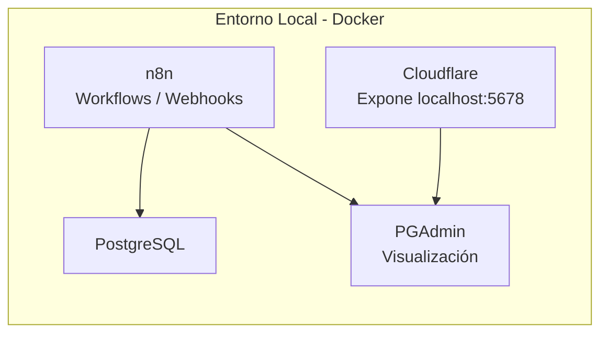
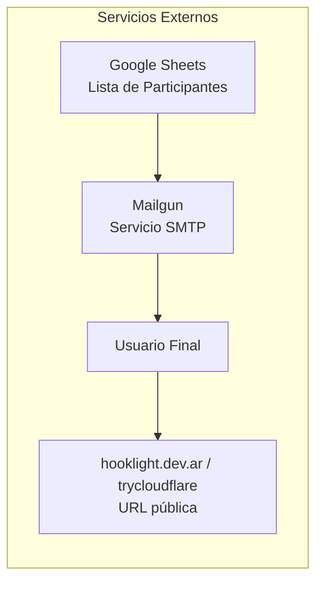
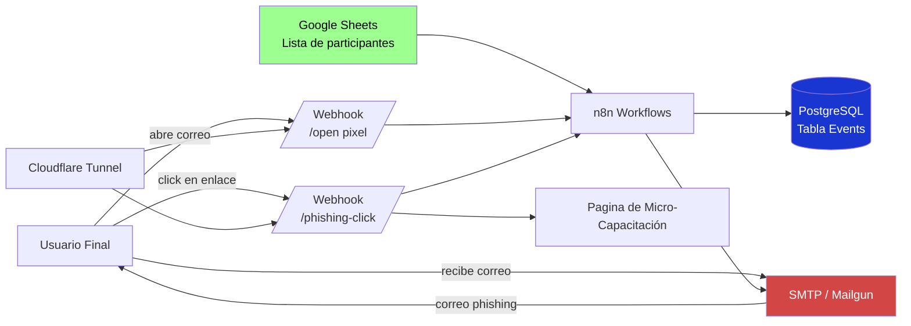

# Sobre el Proyecto

El proyecto consiste en implementar un sistema automatico con capacidad de ejecutar simulaciones de **phishing** de forma controlada, medible y repetible. La solucion se divide en dos bloques: infraestructura en Docker y servicios externos, integrados para automatizar el ciclo completo de campanas y el envio de correos mediante SMTP.

HookLight se posiciona como un servicio de entrenamiento en ciberseguridad orientado a organizaciones que necesitan reducir el riesgo humano. La plataforma permite planificar campanas, segmentar participantes, registrar interacciones y transformar eventos tecnicos en indicadores de gestion para equipos de seguridad, compliance y direccion.

El valor diferencial del servicio esta en la trazabilidad operativa y la capacidad de mejora continua: cada simulacion entrega evidencia cuantificable para priorizar capacitaciones, medir evolucion por periodos y respaldar decisiones con datos reales.

---
### 🐋 Docker Infrastructura

---

#### 📘 [ver explicacion detallada de arquitectura](arquitectura.md)

--- 
La arquitectura del sistema utiliza n8n como motor de automatización de workflows, PostgreSQL para el almacenamiento de datos, servicios SMTP para el envío de correos y herramientas de exposición segura de servicios como Cloudflare Tunnel.

---
### 🌐 Servicios Externos 

---
El proyecto propone el desarrollo de un sistema **automatizado** para la simulación de campañas de **phishing** con fines educativos y de concientización en **ciberseguridad**.

La plataforma permite recrear de forma controlada ataques de ingeniería social con el objetivo de medir el comportamiento de los usuarios frente a correos fraudulentos y mejorar la cultura de seguridad dentro de una organización o entorno académico.

El sistema automatiza todo el ciclo de una campaña de phishing simulada mediante el uso de herramientas de **orquestación** y **monitoreo**. Primero se carga una lista de participantes, luego se envían correos electrónicos simulados que incluyen mecanismos de seguimiento como píxeles de apertura y enlaces de seguimiento. Cuando un usuario interactúa con el correo, el sistema registra eventos como la apertura del mensaje o el clic en el enlace.

#### 📘 [ver explicacion detallada de los flujos](flujo.md)
---
### ♒ Flujo De Automatización

---

El proyecto se basa en principios de ciberseguridad defensiva y ética, incluyendo consentimiento informado de los participantes, minimización de datos personales y anonimización de la información recolectada.

De esta forma, Hooklight permite evaluar de forma práctica la vulnerabilidad humana frente a ataques de phishing y contribuir a mejorar la concientización en seguridad informática mediante entrenamiento basado en experiencias reales.

---
---
#### Temas Relacionados.
+ ### [Ver Diagrama de Flujo](flujo.md)
+ ### [Ver Diagrama de Arquitectura](arquitectura.md)
+ ### [Investigacion sobre pishing](Investigacion.md)
+ ### [Regresar](../README.md)
